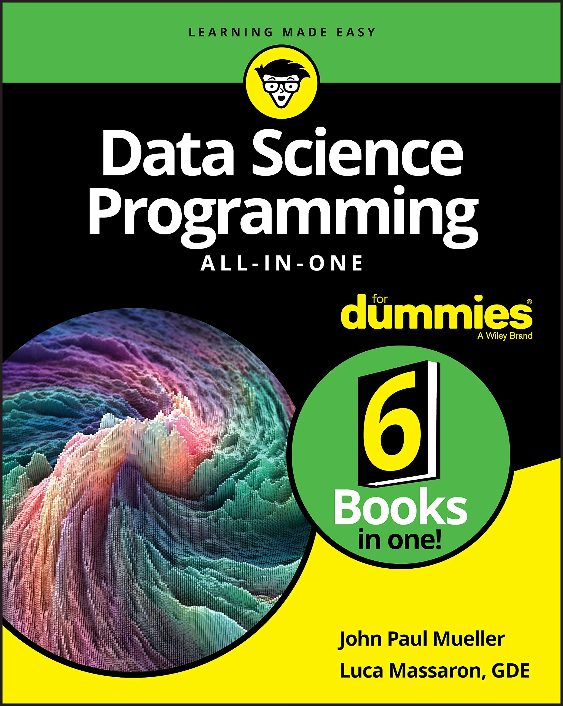

# Manipulating-Data-Algorithms
Notebooks for manipulating data algorithms in Data Science and ML

### Algorithms :
- Regression
- Clustring
- Classification
- Self-made algorithms

#### Using
All practices using this book :

 

## Credits
[0xSaad](https://x.com/0xdonzdev)
